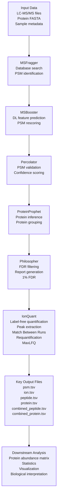

# Understanding the FragPipe Workflow

Before running FragPipe, it is helpful to understand the overall workflow.

Although FragPipe appears as a single application, it combines several softwares that identify peptides, infer proteins, control false discoveries, and quantify peptide or protein abundances from LC-MS/MS experiments.

Understanding the workflow will help you choose appropriate analysis parameters and correctly interpret the results.

---

## Learning Objectives

By the end of this module, you will be able to:

- Understand the overall workflow of a DDA label-free proteomics analysis.
- Recognize the main processing steps performed by FragPipe.
- Understand how LC-MS/MS data are converted into a protein abundance matrix.
- Recognize the main output files.

---

# Overall Workflow

The figure below summarizes a typical FragPipe workflow for Data-Dependent Acquisition (DDA) label-free proteomics.

**Figure 1.** Overview of a typical FragPipe workflow for DDA label-free proteomics.

---

## Workflow Summary

FragPipe processes proteomics data in several main steps:

1. Input data are loaded, including LC-MS/MS spectral files, a protein FASTA database, and sample or experiment manifest.

2. Peptide identification is performed by searching experimental MS/MS spectra against candidate peptide sequences generated from the FASTA database.

3. Peptide-spectrum matches (PSMs) are rescored, validated, and filtered to control the false discovery rate (FDR).

4. Protein inference is performed by assembling validated peptide evidence into protein identifications or protein groups.

5. Label-free quantification is carried out using MS1 precursor ion intensities. When enabled, Match Between Runs reduces missing values by transferring peptide identification evidence between runs, while MaxLFQ estimates protein-level abundances across samples.

6. Output files are generated at multiple levels, including PSMs, peptide ions, peptides, and proteins. For many downstream protein-level analyses, `combined_protein.tsv` is the main starting file, although it often needs to be cleaned or reformatted into a protein abundance matrix before use in statistical analysis tools.

> [!NOTE]
> FragPipe combines several software packages into a single analysis workflow. In this tutorial, the emphasis is on understanding the workflow and interpreting the results, rather than the computational principles behind each software component. For further details about the individual tools, please refer to the official FragPipe documentation.

---

## Step 1. Input Data
Every FragPipe analysis begins with three types of input:
LC-MS/MS spectral files (.raw, .mzML, or other supported formats)
Protein FASTA database
Sample metadata, including the experimental groups and biological replicates
Together, these files tell FragPipe what spectra to analyse, which proteins to search, and how the samples are related.

---

## Step 2. Peptide Identification
The first computational step is identifying peptides.
MSFragger compares each experimental MS/MS spectrum with theoretical peptide spectra generated from the protein sequences in the FASTA database.
The result is a list of peptide-spectrum matches (PSMs), where each spectrum is assigned to the peptide sequence that best explains the observed fragmentation pattern.
At this stage, the matches are still considered candidate identifications and must be validated before they are accepted.

---

## Step 3. Identification Validation
After the initial database search, FragPipe improves and validates the peptide-spectrum matches.
This stage includes:
- MSBooster, which adds predicted peptide features to improve confidence in the matches.
- Percolator, which rescoring peptide-spectrum matches using machine learning.
- Philosopher, which applies false discovery rate (FDR) filtering using a target-decoy strategy.
Only peptide-spectrum matches that pass the selected FDR threshold are retained for downstream analysis.

---

## Step 4. Protein Inference
Proteins are not identified directly from MS/MS spectra. Instead, FragPipe assembles the validated peptides into protein groups using ProteinProphet.
Because some peptides may belong to more than one protein, this step determines the protein or protein group that is best supported by the observed peptide evidence.

---

## Step 5. Label-Free Quantification
Once the proteins have been identified, IonQuant estimates how much of each peptide and protein is present in every sample.
For the LFQ-MBR workflow used in this tutorial, IonQuant performs:
- MS1 peak extraction
- peptide-ion quantification
- Match Between Runs (MBR)
- MaxLFQ protein quantification
The final result is a quantitative protein abundance matrix that can be used for downstream statistical analysis.

---

## Step 6. FragPipe Output Files and Quality Checks

After a successful run, FragPipe generates output tables, configuration files, and log files that summarize the workflow and final results.

Common FragPipe output files include:

* `psm.tsv`
* `ion.tsv`
* `peptide.tsv`
* `protein.tsv`
* `combined_ion.tsv`
* `combined_peptide.tsv`
* `combined_protein.tsv`

Reviewing the output tables and logs is a good habit before moving to downstream analyses, as it helps confirm that the workflow completed successfully and that the identification and quantification results are suitable for further analysis.

---

## Checkpoint

Before continuing, make sure you can answer the following questions:

- [ ] What information is needed before starting a FragPipe analysis?
- [ ] What happens after the RAW files are loaded into FragPipe?
- [ ] What is the difference between peptide identification and protein quantification?
- [ ] Why are peptide-spectrum matches filtered before proteins are inferred?
- [ ] What problem does Match Between Runs (MBR) help address?
- [ ] Which output file will be used in the MetaboAnalyst tutorial?

---

