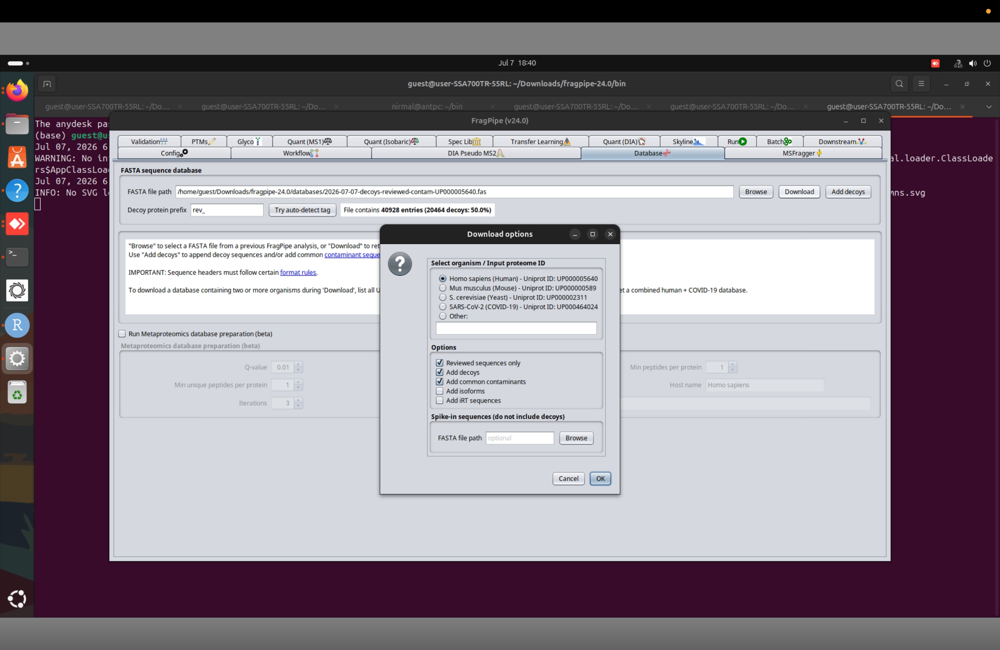

# Preparing Input Files

Before running FragPipe, make sure that the spectral data, protein sequence database, and sample metadata have been prepared correctly.

A successful analysis depends not only on selecting appropriate search parameters but also on providing complete and correctly annotated input data. Even with the right search parameters, incorrect input files or sample annotations can lead to poor protein identification or misleading quantification.

* Identify the data and metadata required for a FragPipe analysis.
* Prepare LC-MS/MS spectral files for a DDA label-free workflow.
* Select an appropriate protein sequence database.
* Assign experimental groups and biological replicates correctly.
* Avoid common errors when preparing FragPipe inputs.

---

# Required Data and Metadata

A typical DDA label-free proteomics workflow requires two main file types and sample metadata.

| Input                   | Purpose                                                                                                           |
| ----------------------- | ----------------------------------------------------------------------------------------------------------------- |
| LC-MS/MS spectral files | Contain the experimental data generated by the mass spectrometer                                                  |
| Protein FASTA database  | Contains the protein sequences used for peptide identification                                                    |
| Sample metadata         | Defines the experimental condition, biological replicate, and acquisition type associated with each spectral file |

Sample metadata do not have to be supplied as a separate file when using the FragPipe graphical interface. The annotations can be entered directly in the LC-MS files table. In headless mode, the same information is supplied through a manifest file.

---

# 1. LC-MS/MS Spectral Files

The first input is the mass spectrometry data generated by the LC-MS/MS instrument.

In this tutorial, we will analyse Thermo RAW files acquired using data-dependent acquisition (DDA).

FragPipe also accepts `.mzML` files. Current FragPipe documentation uses `.mzML` as the standard converted format and provides conversion instructions using MSConvert. Thermo RAW files can be used directly for a DDA label-free workflow.

> **Tip**
>
> For Thermo DDA data, use the original `.raw` files when they are available and readable by FragPipe. Use `.mzML` when an open format is required.

For IonQuant-based label-free quantification, the files must contain the MS1 information required for precursor-intensity measurement. Identification-only formats such as MGF are therefore not appropriate for this tutorial.

---

## Organizing RAW Files

Keep all files from the same project in one folder, although FragPipe can load files from different locations.

For example:

```text
Dataset/
├── Healthy_01.raw
├── Healthy_02.raw
├── Dengue_01.raw
├── Dengue_02.raw
├── Covid_01.raw
└── ...
```

Give each file a clear and unique name so it can be identified easily throughout the analysis. It may include:

* Sample identifier
* Experimental group
* Technical injection number, when applicable
* Fraction number, when applicable

Avoid changing filenames after they have been imported into FragPipe or after analysis has begun. The filename is used in the output reports to identify the corresponding LC-MS run.

---

## Before Importing Spectral Files

Before loading the files into FragPipe, check that:

- all expected files have been transferred successfully
- the files are not empty, truncated, or corrupted
- every filename is unique
- no samples, fractions, or technical injections are missing
- the file format is compatible with the selected FragPipe workflow
- the acquisition method of each file is known
- the appropriate FragPipe data type will be assigned to each file

After loading the spectral files, check and assign the correct data type, such as DDA, DDA+, DIA, DIA-Quant, or DIA-Lib. For this tutorial, all files should be assigned the DDA data type.

---

# 2. Protein FASTA Database

The FASTA database contains the protein sequences used for peptide identification.

During database searching, MSFragger compares the experimental MS/MS spectra with theoretical peptide sequences generated from the proteins in the database.

Proteins whose sequences are absent from the database cannot be directly identified. The database should match both the organisms present in your samples and the question you are trying to answer.

---

## Choosing the Database

The appropriate database depends on the experiment.

| Study                                   | Suggested database                          |
| --------------------------------------- | ------------------------------------------- |
| Human clinical samples                  | Human reference proteome                    |
| Mouse experiment                        | Mouse reference proteome                    |
| Pure bacterial culture                  | Proteome of the bacterial species or strain |
| Host–pathogen study                     | Combined host and pathogen database         |
| Experiment containing spike-in proteins | Biological proteome plus spike-in sequences |

Avoid adding large numbers of unrelated organisms. An unnecessarily large database increases the search space and can reduce the sensitivity of peptide identification.

Include common laboratory contaminant proteins, such as keratins and trypsin, in the FASTA database to improve peptide identification.

---

## Human-Only or Host–Pathogen Database?

The tutorial dataset contains samples from the following groups:

* Healthy
* Dengue
* COVID-19

The database should be selected according to the objective of the analysis.

### Option 1: Human-only database

Choose a human reference proteome when your analysis focuses on human proteins and does not require identification of pathogen proteins.

Using a human-only database means that:

* human proteins can be identified and quantified
* dengue virus proteins cannot be identified
* SARS-CoV-2 proteins cannot be identified
* if a pathogen peptide has a sequence identical to a human peptide, its spectrum may instead be assigned to the matching human sequence and cannot be attributed to the pathogen.

### Option 2: Combined host–pathogen database

Use a combined database when pathogen-protein identification is part of the study.

Because this tutorial contains both dengue and COVID-19 samples, an appropriate combined database would include:

* *Homo sapiens*
* dengue virus sequences relevant to the samples
* SARS-CoV-2

In this tutorial, we will use only human reference proteome.

---

## Selecting Dengue Virus Sequences

Dengue virus has four major serotypes. The FASTA database should contain the serotype or strain relevant to the samples.

If the infecting serotype is unknown, sequences representing all biologically plausible serotypes may be included. However, highly redundant viral entries can complicate protein-level inference because many peptides may be shared among strains or serotypes.

The database composition should be mentioned clearly in the methods section.

---

## Downloading a Reference Proteome

FragPipe can download protein sequences from UniProt through the **Database** tab. Multiple proteomes can be specified using a comma-separated list of UniProt proteome identifiers.

FragPipe recommends UniProt-formatted sequence headers and provides options for adding common contaminants and decoy sequences.



**Figure 1.** Downloading a protein FASTA database using the **Database** tab in FragPipe. Users can download reference proteomes directly from UniProt, add common contaminant sequences, and generate decoy sequences for false discovery rate (FDR) estimation. Multiple proteomes can be combined by entering their UniProt proteome identifiers.

How to add reference proteome:

1. Open the **Database** tab.
2. Select **Download**.
3. Choose the relevant organism or enter its UniProt proteome identifier.
4. Add additional proteomes when a combined database is required.
5. Enable the addition of common contaminants.
6. Enable decoy generation.
7. Save the completed FASTA database.

For a custom database, make sure that the FASTA headers are compatible with FragPipe and Philosopher.

---

## Combining FASTA Files

Target FASTA files can be combined before the database is prepared.

For example:

```bash
cat human.fasta dengue.fasta sars_cov_2.fasta > combined_targets.fasta
```

For beginners, it is easier to let FragPipe or Philosopher handle this step automatically.

> **Important**
>
> Combine the target sequence databases first and add decoys only once. Do not concatenate several databases that already contain their own decoy sequences, because this can create duplicated or incorrectly formatted entries.

---

## Decoy Sequences

Decoy protein sequences are used to estimate the false discovery rate during peptide-spectrum match, peptide, and protein validation.

When downloading a database through FragPipe, select the option to add decoys. For an existing custom target FASTA, use the **Add decoys** function before running the workflow.

After decoys have been added, around half of the database entries may contain the configured decoy prefix.

You do not need to create decoy sequences manually for a standard FragPipe workflow, but you must ensure that the database has been processed using appropriate FragPipe or Philosopher option.

---

# 3. Sample Information

Before running label-free quantification, define how each LC-MS file relates to the experimental design.

For this tutorial:

| Sample     | Experimental group |
| ---------- | ------------------ |
| Healthy_01 | Healthy            |
| Healthy_02 | Healthy            |
| Dengue_01  | Dengue             |
| Dengue_02  | Dengue             |
| Covid_01   | COVID-19           |

In this example, each patient corresponds to one LC-MS file, and each patient is treated as one biological replicate.

---

## Experiment and BioReplicate Fields

FragPipe uses two annotation fields:

### Experiment

The **Experiment** field represents the experimental condition or comparison group.

Examples include:

* `Healthy`
* `Dengue`
* `COVID-19`

It should not normally contain a different value for every individual sample when the objective is to compare groups.

### BioReplicate

The **BioReplicate** field identifies the biological sample represented by each LC-MS/MS run.

In an unpaired clinical study, each patient should be assigned a unique BioReplicate identifier because each patient represents an independent biological replicate. 

If the results will be analysed using MSstats, FragPipe recommends that BioReplicate identifiers should not be reused for unrelated samples, even if they belong to different experimental groups.

---

## Experimental Design for This Tutorial

| RAW file       | Experiment | BioReplicate | Data type |
| -------------- | ---------- | -----------: | --------- |
| Healthy_01.raw | Healthy    |            1 | DDA       |
| Healthy_02.raw | Healthy    |            2 | DDA       |
| Dengue_01.raw  | Dengue     |            3 | DDA       |
| Dengue_02.raw  | Dengue     |            4 | DDA       |
| Covid_01.raw   | COVID-19   |            5 | DDA       |

This design means:

* Healthy_01 and Healthy_02 belong to the same experimental condition
* Dengue_01 and Dengue_02 belong to the same experimental condition
* each patient is an independent biological replicate
* all files were acquired using DDA

---

## Technical Replicate Injections

A technical replicate is a repeated measurement of the same biological sample.

If the same patient digest was injected twice, the files might be annotated as follows:

| RAW file                  | Experiment | BioReplicate | Data type |
| ------------------------- | ---------- | -----------: | --------- |
| Healthy_01_injection1.raw | Healthy    |            1 | DDA       |
| Healthy_01_injection2.raw | Healthy    |            1 | DDA       |

Both files retain the same Experiment and BioReplicate because they originate from the same biological sample.

Do not assign a new biological replicate number to every technical injection. Technical replicates do not increase the number of independent biological observations.

---

## Paired Experimental Designs

In a paired or repeated-measures study, samples collected from the same individual under different conditions should use the same BioReplicate identifier.

For example:

| RAW file             | Experiment | BioReplicate |
| -------------------- | ---------- | -----------: |
| Patient01_Before.raw | Before     |            1 |
| Patient01_After.raw  | After      |            1 |
| Patient02_Before.raw | Before     |            2 |
| Patient02_After.raw  | After      |            2 |

This annotation tells statistical software that the before-and-after samples came from the same participants.

---

## Why Correct Annotation Matters

Correct sample annotation determines how FragPipe generates combined reports and how the tools interpret the experimental design.

IonQuant can report both conventional abundance values and MaxLFQ protein intensities when MaxLFQ is selected in the **Quant (MS1)** tab.

The Experiment and BioReplicate annotations are especially important for:

* producing correctly labelled combined reports
* generating the `MSstats.csv` file
* distinguishing independent and paired samples
* preventing technical replicates from being treated as biological replicates
* performing valid downstream statistical comparisons

---

# Common Mistakes

| Mistake                                                                 | Possible consequence                                                          |
| ----------------------------------------------------------------------- | ----------------------------------------------------------------------------- |
| Selecting the wrong organism database                                   | Reduced or incorrect protein identification                                   |                                 |
| Using a custom FASTA without decoys                                     | FDR estimation and filtering cannot be performed correctly                    |
| Adding decoys more than once                                            | Duplicated entries and an incorrectly constructed search database             |
| Assigning each sample a different experiment name                       | Samples are not grouped correctly by biological condition                     |
| Reusing BioReplicate numbers for unrelated patients across groups       | Downstream software may interpret the data as paired or repeated measurements |
| Assigning separate BioReplicate numbers to technical injections         | Technical measurements may be treated as independent biological samples       |
| Assigning DIA files as DDA                                              | Inappropriate search or quantification settings                               |
| Using identification-only spectral formats for IonQuant LFQ             | MS1-based quantification cannot be performed                                  |
| Changing filenames after setting up the project                         | Difficulty in connecting input files with output reports                         |

---

# Before Moving On

Before continuing, verify that you have:

* All expected RAW or mzML files
* Confirmed that the files contain DDA data
* Checked that all filenames are unique
* Selected the correct host or host–pathogen FASTA database
* Included common contaminant sequences
* Added decoy sequences
* Assigned the correct Experiment to each file
* Assigned a unique BioReplicate to each independent biological sample
* Distinguished biological replicates from technical replicate injections

---

## Questions

Before continuing, make sure you can answer the following questions:

* [ ] Which two file types are needed for a standard FragPipe database-search workflow?
* [ ] Why is the FASTA database important?
* [ ] When should a combined host–pathogen database be used?
* [ ] Which viral proteomes would be needed to identify pathogen proteins in this tutorial?
* [ ] What is the difference between the Experiment and BioReplicate fields?
* [ ] How should technical replicate injections be annotated?
* [ ] Why are decoy and contaminant sequences included?


